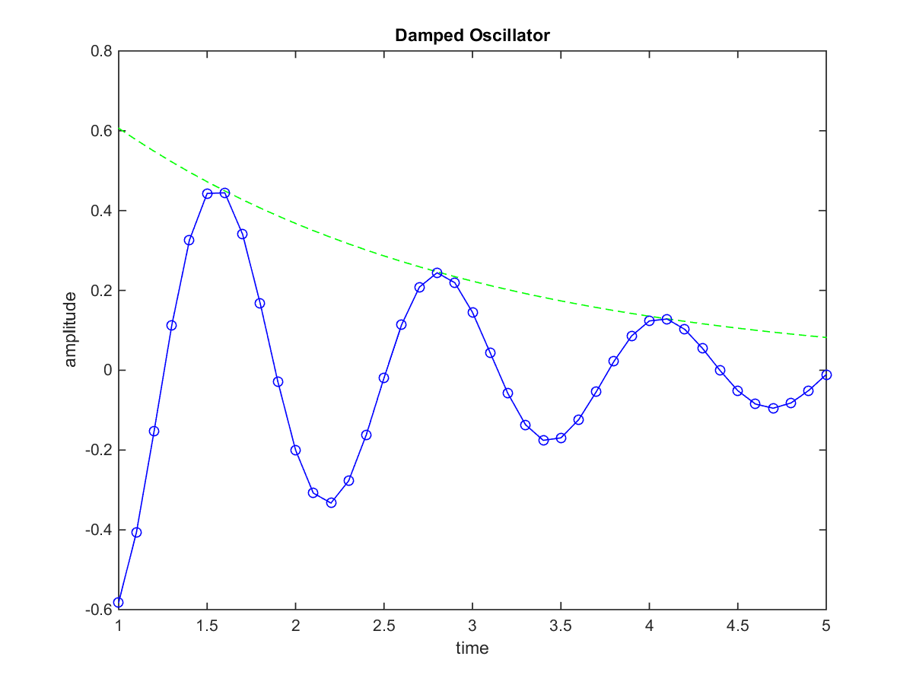

# hw_basicelements
Homework for Garcia 1.2, basic elements of MATLAB

## Contents

*   [Problem 1](#2)
*   [Problem 2](#3)
*   [Problem 3](#4)
*   [Problem 4](#5)
*   [Problem 5](#6)
*   [Problem 6](#7)

## Problem 1

Consider the equation f = (1/2π)√(k1k2/m(k1+k2)) where k1 = 50, k2 = 100, and m = 2.

*   First, assign values for k1, k2, and m.
*   Next, assign the value to a new variable f, using the variables defined in the first step.

## Problem 2

The temperature distribution between to concentric tubes and in the radial direction is:

T = Tb + \[(Ta - Tb)ln(b/r)\]/ln(b/a)

where r is the radius, and a ≤ r ≤ b. Given Ta = 0, Tb = 100, a = 1, and b = 2:

*   Determine the temperature for r = 1.00, 1.01, 1.02, …, 1.99,2.00.
*   Plot radial position (r) versus temperature (T) as a solid line.
*   On top of that plot, plot every 10th temperature value as a circle.
*   Label the axes and provide a title for the plot.

## Problem 3

Create two vectors, a row vector whose elements are 2n+1 and a column vector whose elements are 3n+2, for n = 0,1,…,6.

## Problem 4

Create a 5x5 square matrix whose elements are -1 along the diagonal and 1 everywhere else. Please define the matrix using any of the following built-in functions: <tt>zeros</tt>, <tt>ones</tt>, and <tt>diag</tt>.

## Problem 5

Given the following system of equations

1a + 2b + 3c + 4d = 30

2a + 1b + 3c + 4d = 29

3a + 1b + 2c + 4d = 27

4a + 1b + 2c + 3d = 24

determine a, b, c, and d.

## Problem 6

The motion of a particular damped oscillator is described mathematically as the product of a decay function G1(t) and a sinusoidal function G2(t):

F(t) = G1(t)G2(t) = exp(-t/2)sin(5t)

Reproduce the graph below depicting the decay function G1(t) and the damped oscillatory motion F(t).

[Published with MATLAB® R2014b](http://www.mathworks.com/products/matlab/)  

